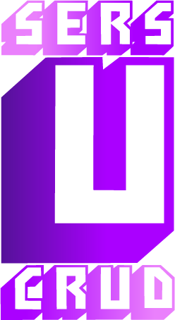
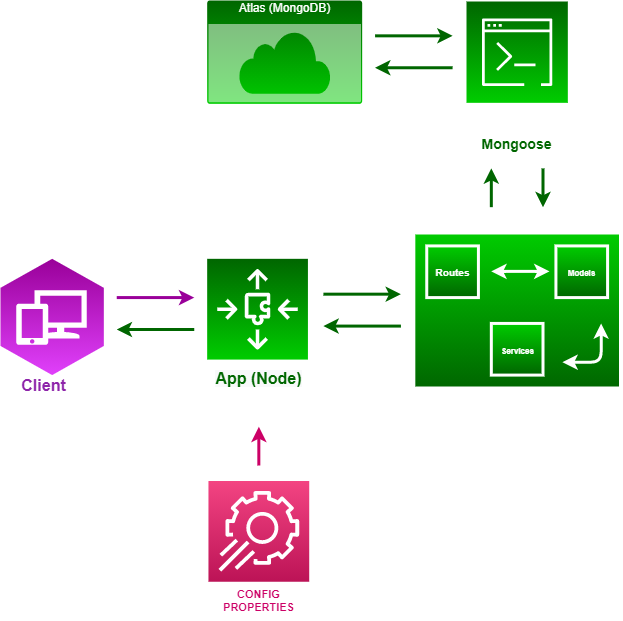
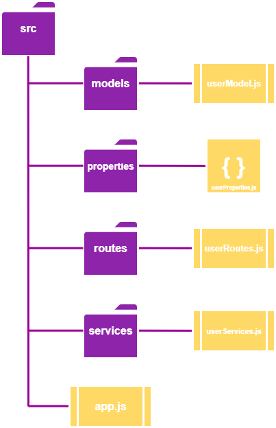

# 💻 User's Crud (API)

<p align="center">
  </img>
</p>

## <strong>Description</strong>

Simple API that implements a User's CRUD using Node.Js and MongoDB. Created as a job application challenge - build an Vue.Js web.app that contemplate a User's CRUD (Create, Read, Update and Delete).

<br/>

<strong>API URL</strong>: https://users-simple-crud.herokuapp.com/

<br/>

## Entity Diagram

<p align="center">
  </img>
</p>


<br/>

## Procedure Mapping

<strong>Services</strong> - User Data Validation:
- userDataCheck(): verifies if the request body has some empty field (name, cpf, email).
- getUserByID(): return the first user with a given ID.
- getUsers(): return all registered users.
- getUserByName(), ByCpf() and ByEmail(): return the first user with a giver parameter.
- updateUserEmail(): updates the email of a user, with it's given ID.
- createUser(): register a user with the given parameters.
- emptyName(), CPF() and Email(): check if the given parameter is a empty value.

<br/>

<strong>Routes</strong> - Database CRUD:
Main route: "/api/users"
- POST("/"): create user.
- GET("/"): list all users.
- GET("/name","/cpf","/email"): search a user with a given parameter.
- PUT("/email"): change the email of the user with a given ID, since name and CPF values do not change over time.
- DELETE("/"): delete the user with a given ID.

<br/>


## Files Organization

<p align="center">
  </img>
</p>

<br/>

The source folder is the root of the project. Inside that folder, we have: properties - json file with error status codes and messages; models - containing the user object schema for mongoose; services - containing validation functions; routes - containing the http routes for CRUD (Post, Get, Put and Delete).

<br/>

## Future Improvements

- Separate the routes from the controllers.
- Implement a authentication system using JWT (<a href="https://jwt.io/">Json Web Token</a>).
- Change the file organization (<a href="https://dev.to/devlcodes/file-structure-of-a-node-project-3opk">Node.Js File Organization</a>).

## Used Technologies

- Heroku App (<a href="https://www.heroku.com/">Free Backend Deployment/ Cloud Application Platform</a>)
- Node.Js (<a href="https://nodejs.org/">Javascript runtime Chrome built engine</a>)
- MongoDB (<a href="https://www.mongodb.com/">General purpose, document-based, distributed database built for modern applications</a>)
- Mongoose (<a href="https://mongoosejs.com/">Mongodb object modeling for Node.js</a>)
- Express (<a href="https://expressjs.com/pt-br/">Web App Node.Js Framework</a>)

## Installation

Clone this git repo:
```javascript
git clone https://github.com/Luizbrandt/user-crud-simple-api
```

Install node modules and packages (npm):
```javascript
npm install
```
